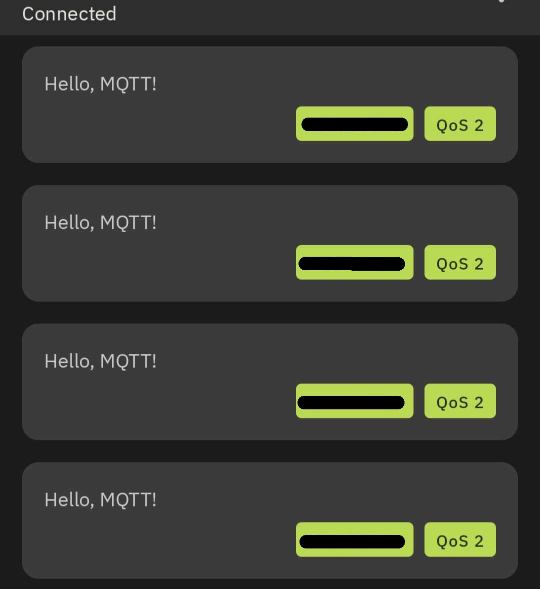

# Publikator MQTT QOS2 na Raspberry Pi Pico Python

## Wstęp teoretyczny
MQTT (Message Queuing Telemetry Transport) w Quality of Service (QoS) 2 to protokół komunikacyjny, który zapewnia wyższy poziom pewności dostarczenia wiadomości w porównaniu do niższych poziomów QoS (0 i 1). W kontekście QoS 2 w MQTT, ten protokół umożliwia gwarancję, że każda wiadomość będzie dostarczona dokładnie raz do odbiorcy, eliminując jednocześnie ryzyko utraty lub zdublowania wiadomości.

### Etapy
Początkowa Publikacja
PUBLISH: Nadawca (wydawca) zaczyna od wysłania wiadomości PUBLISH do odbiorcy (subskrybenta). Wiadomość zawiera temat MQTT, ładunek wiadomości i unikalny identyfikator pakietu (PID). Flagę DUP ustawia się na 0 dla pierwszej transmisji pakietu PUBLISH.

Potwierdzenie Odbioru
PUBREC: Po otrzymaniu wiadomości PUBLISH, odbiorca wysyła z powrotem wiadomość PUBREC (Otrzymano publikację) zawierającą ten sam PID, potwierdzając, że wiadomość została odebrana. To nie oznacza, że wiadomość została przetworzona, tylko że dotarła.

Zwolnienie Wiadomości
PUBREL: Po otrzymaniu PUBREC, nadawca przesyła wiadomość PUBREL (Zwolnienie publikacji) z tym samym PID, oznaczając, że teraz może zwolnić wiadomość. Ten krok jest kluczowy, ponieważ zapobiega ponownemu dostarczeniu wiadomości w przypadku awarii sieci lub innych problemów.

Ostateczne Potwierdzenie
PUBCOMP: Wreszcie, odbiorca wysyła wiadomość PUBCOMP (Zakończono publikację) z tym samym PID z powrotem do nadawcy. Oznacza to, że wiadomość została odebrana i przetworzona, finalizując przepływ QoS 2.
# 

## O projekcie
Podczas projektu korzystaliśmy z repozytorium: https://github.com/micropython/micropython-lib/blob/master/micropython/umqtt.simple/umqtt/simple.py dopisaliśmy w nim obsługę QoS 2 w publikatorze. 
### 
Kod który wykonaliśmy znajduje się w pliku **simple.py** w liniach **167-231**. Program main.py odpowiada za przetestowanie działania QoS 2. 

## Wynik
Przykładowy zrzut ekranu w aplikacji mobilnej obrazujący odebranie wiadomości przez Raspberry Pi Pico
  

